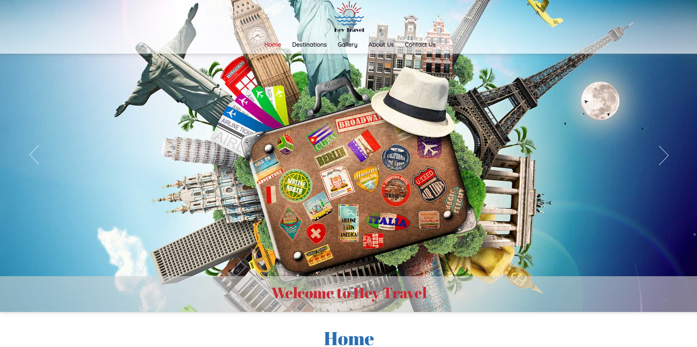
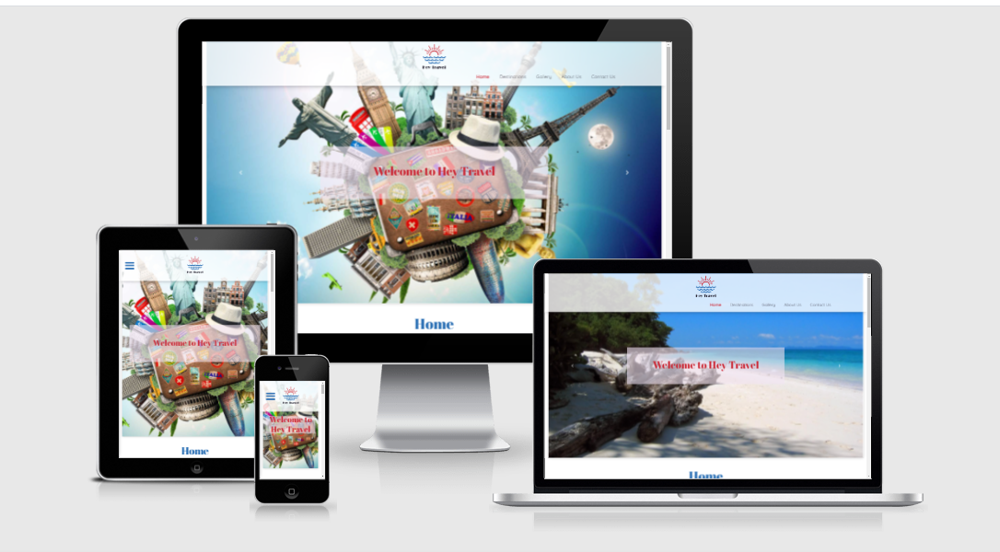
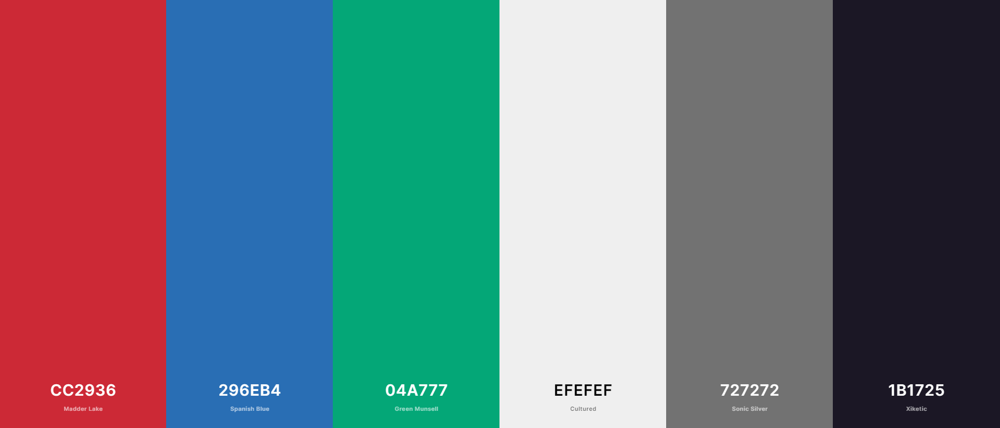
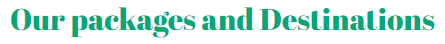
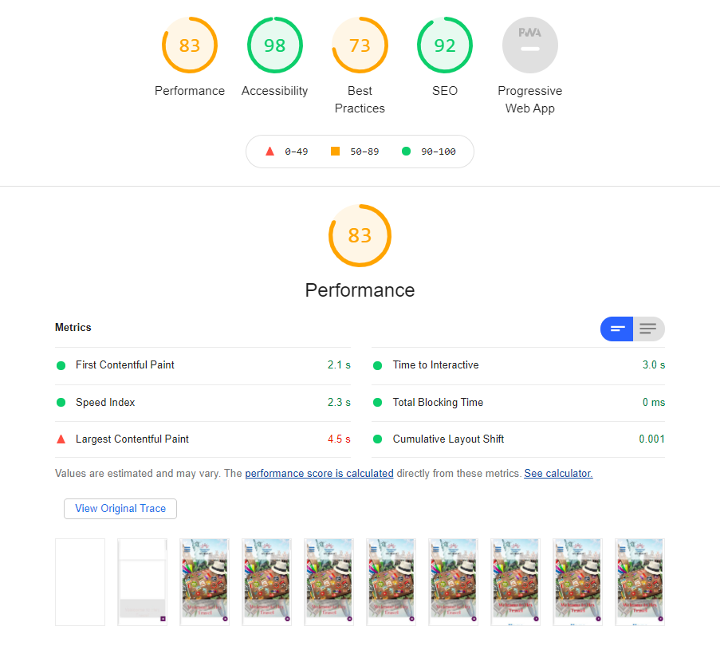

# milestone-project-02  
# Interactive Front-End Development / Hey Travel

[Live site on GitHub Pages](https://andrewskyboss.github.io/milestone-project-02)

# Author
Andrew

- [milestone-project-02](#milestone-project-02)
- [Interactive Front-End Development / Hey Travel](#interactive-front-end-development--hey-travel)
- [Author](#author)
  * [Project Overview](#project-overview)
  * [UX](#ux)
    + [Project Goals](#project-goals)
      - [The goals of this project are:](#the-goals-of-this-project-are)
      - [User Goals](#user-goals)
      - [Developer Goals](#developer-goals)
      - [Website Owner Goals](#website-owner-goals)
    + [User Stories](#user-stories)
    + [Design Choices](#design-choices)
      - [Colors](#colors)
      - [Typography](#typography)
      - [Images](#images)
      - [Design Elements](#design-elements)
      - [Animations and Transitions](#animations-and-transitions)
    + [Wireframes](#wireframes)
    + [Features](#features)
      - [Implemented Features](#implemented-features)
      - [Search Engine Optimization (SEO) & Sitemap](#search-engine-optimization-seo--sitemap)
      - [Future Features](#future-features)
  * [Technologies Used](#technologies-used)
    + [Frameworks and Extensions](#frameworks-and-extensions)
    + [Fonts](#fonts)
    + [Programming Languages](#programming-languages)
  * [Tools and Resources](#tools-and-resources)
  * [Testing](#testing)
    + [Lighthouse Performance](#lighthouse-performance)
  * [Code Validity](#code-validity)
  * [Version Control](#version-control)
  * [Deployment](#deployment)
  * [Credits](#credits)
    + [Content](#content)
    + [Media](#media)
    + [Code Snippets and Tutorials](#code-snippets-and-tutorials)
    + [Acknowledgments](#acknowledgments)

<small><i><a href='http://ecotrust-canada.github.io/markdown-toc/' target="_blank">Table of contents generated with markdown-toc</a></i></small>

---

## Project Overview

- Below is a picture of the site that shows it in responsive states:  
  [Link to check a website to be responsive](http://ami.responsivedesign.is)  
  
- Hey Travel is a website where users can find a holiday destination for their needs. For their convenience, there is a Map with proposed destination markers. As well, users can choose a travel package from this website. To get inspiration about destinations, there are lots of visual materials placed in different manners, such as Hero sliders, Grid images, and Gallery. As well, users have a form to contact the website owner to get all necessary information.

- Despite the existing travel situation, people still want to travel. They are looking for new destinations and possibilities to go out from home. That means any Travel and destinations website, this version as well, has a very high commercial value. It has a modern design and lots of visual components. The design was built using the latest UI/UX principles.

- [Link to deployed website](https://andrewskyboss.github.io/milestone-project-02)

---

## UX

### Project Goals

#### The goals of this project are:
- Design, develop, and implement a dynamic front-end web application using HTML, CSS, and JavaScript.
- Meet target audience users’ needs using UI/UX design principles.
- Implement front-end interactivity using core JavaScript, JavaScript libraries, and Application Programming Interfaces (APIs).
- Test an interactive front-end web application through the development, implementation, and deployment stages.
- Deploy an interactive front-end web application to a Cloud platform.
- Demonstrate and document the development process through a version control system.
- Learn JavaScript theory and practically implement all gained knowledge.

#### User Goals
- The target audience of this website is very wide, covering different ages, statuses, families, or single people.

Common types of users are:
- **New customers:** The users’ main goal is to get necessary travel information. They are ready for travel and can spend time choosing a destination. They are ready to get inspiration from imagery and customer reviews.
- **Existing customers:** They know the website structure and are ready to travel. Some want to be inspired by imagery or video to choose a new destination; others know their destination and want to make a quick decision.
- **Admin:** Their goal is to get access to back-end information to manage it.
- *Note:* This website does not propose a login system.

#### Developer Goals
- Design and implement a front-end web application based on the best principles of user experience design, accessibility, and responsiveness.
- Implement a dynamic front-end web application using HTML, CSS, and JavaScript technologies.
- Clearly document the process for future usage and reference.
- Use version control software to maintain and share code with other developers.
- Test and deploy the web application to a Cloud platform.
- Demonstrate abilities and knowledge gained during the course.
- Gain hands-on experience in project development.

#### Website Owner Goals
Main goals of the website owner are:
- Sell more travel packages.
- Showcase existing destinations.
- Present relevant information about countries and destinations.
- Make information structured and easy to read.
- Attract users to buy existing packages.
- Provide accessible contact information.

---

### User Stories

- **As a Single Traveller, I want to have:**
  1. Ability to easily find all possible destinations to choose from.
  2. Ability to view visual information about destinations.
  3. Ability to easily find all possible attractions there.
  4. Ability to easily find detailed information about attractions.
  5. Ability to easily find all proposed Travel packages and what is included.
  6. Ability to easily see the price for every package.
  7. Ability to easily find information about flights or other transportation methods.
  8. Ability to easily find visa and customs information.
  9. Ability to easily find health precautions and required vaccinations.
  10. Ability to easily find contact information.

- **As a Group Traveller (in addition to Single Traveller needs), I want to have:**
  1. Ability to easily find information for group attractions.

- **As a Family Traveller (in addition to Single and Group Traveller needs), I want to have:**
  1. Ability to easily find information about family attractions.
  2. Ability to easily find information about child requirements (if any).

---

### Design Choices

This project was built based on target audience needs. Since the target audience is broad, design choices focus on universal appeal. Elements of nature (water, sun, greenery) are represented through nice imagery and a balanced color palette. The design is clean and simple, keeping focus on images while remaining useful, usable, and valuable. The process followed the five planes of User Experience:

- **Strategy Plane** – Represents business goals. Main design aims to keep layout simple and classical with bright accents (Imperial Red color). Information is well-structured and accessible via top navigation (no more than 3 clicks to access core information).
- **Scope Plane** – Includes key planned features:
  - Header navigation
  - Mobile sliding navigation
  - Intuitive design structure
  - SVG logo at the top
  - Hero Slider
  - Image Gallery with modal popup window
  - Grid image layout
  - Google Map with custom markers
  - Contact form & EmailJS integration
  - Social media links
- **Structure Plane** – Content is logically organized in main navigation items. Destination details and packages are accessible through the Destinations page and grid system on the homepage.
- **Skeleton Plane** – Layout structured using wireframe mockups (Desktop, Tablet, Mobile).
- **Surface Plane** – Classical design style with modern UI elements. The *Abril Fatface* heading font brings a stylish editorial look, while pale shades of blue, red, and green evoke water, sun, and nature. Light backgrounds and soft fade transitions provide elegance.

#### Colors
The color palette represents natural tones: pale shades of blue, red, and green combined with neutral gray tones to evoke emotional trust and rest.
- Palette created using [Coolors](https://coolors.co):  
  

#### Typography
- **Body Font:** *Quicksand* (sans-serif), 16px. Clean, legible, and comfortable to read.
- **Headings:** *Abril Fatface*. Modern take on classic heavy titling fonts with high contrast and strong visual presence.
- **Font Sizes:**  
  - Desktop: H1 = 50px, H2 = 40px, H3 = 30px, Body = 16px.  
  - Mobile: H1 = 40px, H2 = 35px, H3 = 27px, Body = 16px.

  
  
  
  
- [Abril Fatface on Google Fonts](https://fonts.google.com/specimen/Abril+Fatface)  
- [Quicksand on Google Fonts](https://fonts.google.com/specimen/Quicksand)

#### Images
- Features high-quality images representing destinations: Ireland, Germany, France, Italy, and Spain.
- Font Awesome icons represent social media platforms.
- Custom SVG arrows and closing icons created for lightboxes and menus.
- [Images sourced from Megapixl](https://www.megapixl.com)

#### Design Elements
- Top Navigation Bar (Desktop)
- Mobile Sidebar Navigation
- Footer & Social Links
- Section Containers & Grid Columns
- CTA Buttons & Inputs
- Modal Popups / Lightbox
- Google Maps Integration
- Contact Form & Newsletter Subscription

#### Animations and Transitions
- **Zoom-in:** Applied to grid images, gallery items, and social icons on hover.
- **Fade-in from bottom:** Applied to H1/H2 titles and gallery lightbox images.
- **Sliding transition:** Lightbox opening/closing and mobile menu drawer.
- **Rotation:** Close icon on the gallery lightbox window.
- **Hover States:** Smooth color changes on buttons, social icons, and navbar items.

---

### Wireframes

Wireframes were designed using [Balsamiq](https://balsamiq.com/wireframes/):
- [Desktop View Wireframes](assets/documents/desctop.pdf)
- [Tablet View Wireframes](assets/documents/tab.pdf)
- [Mobile View Wireframes](assets/documents/mobile.pdf)

---

### Features

- Clear, responsive, and intuitive interface across all screen sizes.
- Fixed header navigation with smooth mobile navigation menu.
- Clickable header logo routing to homepage.
- Interactive hero image slider.
- Pop-up modal lightbox gallery for large image previews.
- Google Maps integration with custom JSON location markers and info windows.
- Working contact form powered by EmailJS API.
- Social media icon bar in footer.
- Newsletter signup form in footer.

#### Implemented Features
All planned core features have been fully implemented, tested, and deployed.

#### Search Engine Optimization (SEO) & Sitemap
- **XML Sitemap (`sitemap.xml`):** Created and deployed at the repository root level to map all 5 canonical site pages (`index.html`, `destinations.html`, `gallery.html`, `about.html`, `contact.html`) for search engine crawlers and web indexers.
- **Robots Instructions (`robots.txt`):** Configured to allow indexing across public site routes while explicitly disallowing search crawlers from indexing utility error pages (e.g., custom `404.html`).
- **Structured Data (JSON-LD):** Implemented schema annotations (e.g., `WebSite`, `ImageGallery`, `ContactPage`, `AboutPage`) for enhanced search visibility.
- **Meta Tags & Social Cards:** Comprehensive meta descriptions, keywords, Open Graph (`og:`), and Twitter Cards configured on every page.

#### Future Features
- Add more destinations and markers on the interactive map.
- Add destination images inside map info windows.
- Implement search & filter functionality for travel packages.
- Add live flight and hotel booking integration.

---

## Technologies Used

### Frameworks, Libraries, and APIs
- [Bootstrap 4.0](https://getbootstrap.com/docs/4.0/getting-started/introduction/) - Responsive grid layout & UI components.
- [jQuery](https://jquery.com) - JavaScript library for simplified DOM manipulation.
- [EmailJS](https://www.emailjs.com/) - Frontend JavaScript API for dispatching contact form emails.
- [Google Maps API](https://developers.google.com/maps/documentation/javascript/overview) - Interactive location maps.

### Fonts & Icons
- [Google Fonts](https://fonts.google.com/) (*Abril Fatface*, *Quicksand*)
- [Font Awesome 4.7.0](https://fontawesome.com/v4.7.0/)

### Programming Languages
- [HTML5](https://www.w3schools.com/html/default.asp) - Markup structure.
- [CSS3](https://www.w3schools.com/css/default.asp) - Styling and animations.
- [JavaScript (ES6)](https://www.javascript.com) - Frontend logic and DOM interaction.
- [JSON](https://www.json.org/json-en.html) - Location data storage.

---

## Tools and Resources
- [Balsamiq Wireframes](https://balsamiq.com/wireframes/)
- [Am I Responsive](http://ami.responsivedesign.is/) - Multi-device mockup generator.
- [Coolors](https://coolors.co) - Color palette generator.
- [W3C Validation Services](https://validator.w3.org/) - Code quality checks.
- [JSHint](https://jshint.com/) - JavaScript linting and validation.
- [Adobe Illustrator & Photoshop](https://www.adobe.com) - Asset creation & image optimization.

---

## Testing

Testing documentation is available in the separate [Testing Document](assets/documents/Testing.md).

### Lighthouse Performance

---

## Code Validity
- Validated via [W3C CSS Validation Service](https://jigsaw.w3.org/css-validator/).
- Validated via [W3C Markup Validation Service](https://validator.w3.org/).
- Validated via [JSHint Service](https://jshint.com/) for JavaScript syntax and quality.
- Checked using [Closing Tag Checker for HTML5](https://www.aliciaramirez.com/closing-tags-checker/).

---

## Version Control
- Git was used for local version control with regular commits and descriptive messages.
- Code was stored and managed on GitHub.

---

## Deployment

Project developed in Gitpod and deployed via **GitHub Pages**.

### Steps to Deploy:
1. Log in to GitHub.
2. Select repository `milestone-project-02`.
3. Go to **Settings** -> **Pages** (in left sidebar).
4. Under **Source**, select **Branch: main** and folder **/(root)**, then click **Save**.
5. Refresh after a minute; the live link will be displayed at the top of the Pages section.
6. Link added to repository **About** section on the main code page.

### Running Locally / Cloning:
1. Open terminal or Gitpod workspace.
2. Clone repository via command:  
   `git clone https://github.com/andrewskyboss/milestone-project-02.git`
3. Open `index.html` in browser or run via local web server extension.

---

## Credits

### Content
- Destination information sourced from [Wikipedia](https://en.wikipedia.org) pages for Ireland, Germany, France, Italy, and Spain.
- Package descriptions adapted from [Expedia](https://www.expedia.ie).

### Media
- Photography sourced from [Megapixl](https://www.megapixl.com).
- Icons provided by [Font Awesome](https://fontawesome.com/v4.7.0/).
- Custom SVG icons created in Adobe Illustrator.

### Code Snippets and Tutorials
- Bootstrap Carousel documentation.
- Lightbox popup code adapted from [CodingNepal Tutorials](https://www.youtube.com/watch?v=rz_8NDyC6Xk).
- Google Maps setup adapted from [Sam Codes Tutorials](https://www.youtube.com/watch?v=uPhWSyRqQDA) and official [Google Maps API Docs](https://developers.google.com/maps/documentation/javascript/overview).
- EmailJS contact form implementation based on Code Institute walkthroughs.

### Acknowledgments
- Mentor **Malia Havlicek** for feedback, reviews, and guidance throughout the project.
- Code Institute tutors and community for support.
