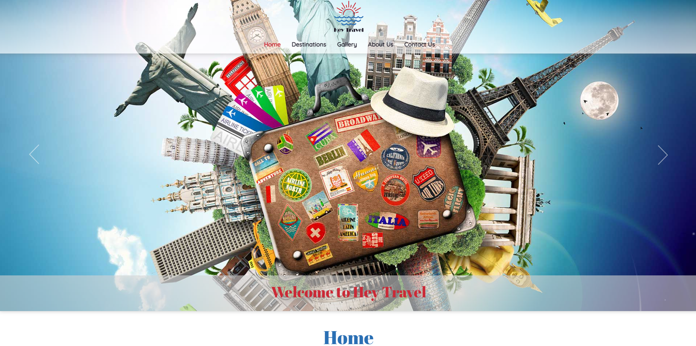

# milestone-project-02 
# Interactive Front-End Development / Hey Travel

[Live site on Github Pages](https://andrewskyboss.github.io/milestone-project-02)

# Author
Andrej Cybovskij

## Project Overview

- Below is a picture of site that shows it in responsive states. 
[link to check a website to be responsive](http://ami.responsivedesign.is)

- The project idea is to create a personal portfolio website (for Andrej Cybovskij). 
	This websites goal is to represent Autor for potential Employers and Recruiters in a best light and get hired. 
    The main users of this website are a business people and their representatives. 
    The websites include of the following features: 
	- Educational overview and work experience. 
	- As well it presents Author's skills and relevant competencies.
	- Provides embedded portfolio examples and contact information for recruiters

- The main users of this website are a business people and their representatives. 
- Website design is clean and clear for Business people. 
- Clear structure makes it quick accessible and easy to use.
- All those features makes it highly efficient to achieve main target to be hired.

- [Link to a deployed website](https://andrewskyboss.github.io/milestone-project-02)

## UX

### Project Goals

The goals of this project are:
- Create a front-end web application based on the principles of user experience design, accessibility and responsivity.
- Develop and implement a static front-end web application using HTML and CSS.
- Create documentation to maximize code structure and organization  maintainability in the future.
- Use version control software to maintain and share code with other developers in a easiest way.
- Test and deploy web application to a Cloud platform for easy access from different sources.

#### User Goals

- The main users of this website are a business people and their representatives.

Common types of users are:
- New customer or unauthenticate user main goal is to get all information they need as quick as possible.
- Existing customers knows website structure and could wondering for any updates and new information.
- Admin goal is to get access to the back end information to manage it.
- This website does not proposing any login system.

#### Developer Goals
- Create a front-end web application based on the principles of user experience design, accessibility and responsivity.
- Develop and implement a static front-end web application using HTML and CSS.
- Create project documentation.
- Use version control software to maintain and share code with other developers.
- Test and deploy web application to a Cloud platform.
- Demonstrate my abilities and knowledge i gained during my course.
- Get experience in a project development.

#### Website Owner Goals
Main goals of website owner are:
- To get a dream job.
- Represent himself to an potentional Employeers.
- Represent all needed information for a potential Employeers in a highly accessible way.
- To make information more structural.
- Showcase existing portfolios.
- Represent contact information to an employeers or customers.

### User Stories

- As an Employer I want to have:
  1. The ability to easily find potential employee past Experience information.
  2. The ability to easily find potential employee Education information.
  3. The ability to easily find potential employee Portfolio or work examples.
  4. The ability to easily find potential employee Contact information.
  5. The ability to easily find potential employee access to Social links.
  6. The ability to easily download potential employee CV and Cover Letter.

- As a Freelancer's Customer I want to have:
  1. The ability to easily find potential freelancer past Experience information.
  2. The ability to easily find potential freelancer Portfolio or work examples.
  3. The ability to easily find potential freelancer Contact information.
  4. The ability to easily find potential freelancer access to Social links.

### Design Choices

This project was built based on UX concerns: website should be useful, usable and valuable for the customer and owner. As well to get a positive user experience, were used process of five planes of user experience:
- **Strategy Plane**  – represents business goals. The main website owner goals were presented above. Just a reminder, that main user of this website will be a business people. Whole design should be kept simple in classical style with some bright elements (in this project Imperial Red color plays as bright element). Design should be plain and modern. Information should be well structured and easy to access. Main parts of the information are placed into top navigation. No more than 3 clicks to get information about website owner. Download button is placed in a footer navigation to get CV printable copy.

- **Scope plane** - represents features we want to include into design. This project features are: 
  - Header and footer navigation.
  - Intuitive design.
  - Short description on top of the page.
  - Contact form with CTA, to be in touch with website's owner.
  - Social media icons
  - Biography (Study and work history)
  - Images as a visual representatives.
  - Embedded portfolios.

- **Structure plane** - Usually users are visiting website to get just for some king of content. Information is logically structured into main parts. All parts placed to the navigation.

- **Skeleton plane** - part for mock-ups:
  - Wireframes links are presented below:
  - [Link to a Wireframes for a Desctop view](assets/documents/A.Cybovskij-Desctop.pdf)
  - [Link to a Wireframes for Tablet and Mobile views ](assets/documents/A.Cybovskij-Tablet-mobile.pdf)

- **Surface plane** - final part of design procedure. The project build in a Classical style. Cinzel and Rylaway fonts gives easy shapes. Shades of Blue, Red and gold are acceptable by the business people as a pleasant and trust. Images are very clear and simple. First look to the website gives a feeling about website owner. Elegant fade in animation gives lightweight and elegance feeling.

#### Colors
The main inspiration of the colors started from the Oxford Blue color.

By the [empower-yourself-with-color-psychology.com website](https://www.empower-yourself-with-color-psychology.com/blue-in-business.html#:~:text=Blue%20is%20the%20most%20universally,indicates%20confidence%2C%20reliability%20and%20responsibility.) 
"Blue is the most universally favored color of all and therefore the safest to use. It relates to trust, honesty and dependability, therefore helping to build customer loyalty. Blue indicates confidence, reliability and responsibility"
- As a major color, the Oxford Blue (#0A0E29) is responsible to create a trust feeling from an employer to a potential employee. 
- Space Cadet (#2D325A) is a same blue group color and gives a variety and lighter shade. 
- Secondary color is Imperial Red (#F71735). As a shade of red, gives us feeling of energy, passion and action. It’s important to show a creativity and energy for a potential employer. 
- Accent color is Gold Metallic (#DBB13B). As a shade of yellow should create a feeling of success, achievement and triumph. 
- Pale Purple Pantone (#F1E4F3) color is a neutral and combines all colors together
- Combination of those colors should create emotional trust and future potential. Those feelings and website content should help the Author to achieve his goals to be hired.

- Color palete was created using [Coolors resources](https://coolors.co)
- 

#### Typography
- Elegant Quicksand sans-serif typeface family font, were using in this project for the body text.
- Abril Fatface font is universal and contemporary style font, displays strong presence on the page to attract attention was using for all titles in this project.

- Body font is Quicksand 16px. This body font size is common for many project as easy to read and good for design as well.
- All titles are in Abril Fatface font’s family. This font is based on classical Proportions and has variety of sizes. H1 as main title is in size of 40px. It is quite big size, but looks very elegant. H2 title is in size of 35px. H3 and H4 titles are in same size of 30px.
- All fonts are reduced in size for mobile devices to fit into the small screen of devices:
- H1 = 40px, H2 = 35px, H3 = 27px.
- body font is in same size for mobile devices.

- Font examples are presented below:
- H1 Abril Fatface 50px 
- H2 Abril Fatface 40px 
- H3 Abril Fatface 30px 
- Paragraph (body) Quicksand 16px 
- [Abril Fatface font can be found here](https://fonts.google.com/specimen/Abril+Fatface)
- [Quicksand  font can be found here](https://fonts.google.com/specimen/Quicksand)
 

#### Images
- On website were used variety of images with open laptop screen. Open laptop looks like an open to opportunity. City views like a coding structure, organised and working properly.
- As well were used Font Awesome libraries icons to display all major social media. Icons takes small amount off space, but looks very presentable and modern.
- As well were used Programming languages svg icons to visualize them.
- [Images were taken from the Megapixl resources](https://www.megapixl.com)

#### Design Elements
List of elements used on website: 
- top menu (desktop navigation)
- mobile (side navigation)
- footer
- containers/section
- buttons
- text input
- textarea inputs
- images (.png, .jpg, .svg)
- icons

#### Animations and Transitions

- Project has fade in from the bottom animation for h1, h2 and h3 titles.

As well animation is added to the following elements:
- Image-lightbox - sliding from/to the top, 
- Images, fade in from the bottom animation inside the Gallery Light box, 
- Rotation animation for the closing button on Gallery Light box, 
- Image zoom in effect on Images in the Gallery.
- Location icons 

 Its draws attention to them. As well it's shows on About Me modules as a hover animation and images have a scale effect. 
- Hover state is used for all icons and logos. On hover icons are changing color and have a scale transformation.
- Programming languages logos have a grayscale filter. On hover grayscale filter is equal to zero and images have their original color. As well Logos have scale transformation.
- As well hover effect is added to top, footer navigation elements and Contact button. All those elements are changing background color.

### Wireframes

The wireframes were created using [Balsamiq](https://balsamiq.com/wireframes/) software. It was a part of Scope Plane of design process.
- Wireframes links are presented below:
- [Link to a Wireframes for a Desctop view](assets/documents/desctop.pdf)
- [Link to a Wireframes for Tablet view ](assets/documents/tab.pdf)
- [Link to a Wireframes for Mobile view ](assets/documents/mobile.pdf)

### Features

Following features will be used in this project:

  - Header and footer navigations. Implemented in full. And working properly
  - Intuitive design. All website’s elements are known by any users. They knows exactly what to do on any of them. Navigations are in traditional places. Social icons are presented by their standard logos. Design is clear and understandable.
  - Short description on top of the page. Implemented. Exceptions are Contact and Experience pages
  - Contact form with CTA, to be in touch with website's owner. Implemented. Connected to the Code Institute server for demonstration purpose only.
  - Social media icons are at the bottom of every page
  - Biography (Study and work history). Presented in two pages: Profile for studies and Experience for Work experience. Customer can choose what is more important for him.
  - Images as a visual representatives. Used relevant images to demonstrate content.
  - Embedded portfolios. Used iframes to embed work examples

#### Implemented Features

The project has implemented following features:
  - Header and footer navigation.
  - Intuitive design.
  - Short description on top of the page.
  - Contact form with CTA, to be in touch with website's owner.
  - Social media icons
  - Biography (Study and work history)
  - Images as a visual representatives.
  - Embedded portfolios.

Header navigation is different on desktop and mobile versions.

#### Future Features

Features to be implemented in the future:
- Add more design elements
- Add interactivity possibility
- Testimonials section or page
- More High quality images
- Add coding portfolio (examples)

## Technologies Used

3rd party technologies to list:
- Wirefames by Balsamiq to get quick preview of the project
- Color palette resources to get a visual representation of all branding colors 
- Images were taken from the Megapixl resources to get illustrations and logos for the website
- Font Awesome Icons to represent social media in graphic way
- Google Fonts
- Markdown table generator
- Markdown table of contents

### Programing Languages
- [JQuery](https://jquery.com) The project uses **JQuery** to simplify DOM manipulation.
- [CSS](https://www.w3schools.com/w3css/default.asp) The project uses **CSS** to define DOM appearance.
- [HTML](https://www.w3schools.com/html/default.asp) The project uses **HTML** to define DOM elements.
- [Markdown](https://www.markdownguide.org/) Documentation within the readme was generated using markdown

## Tools and Resources
- [Wirefames by Balsamiq](https://balsamiq.com/wireframes/) 
- [Color palette resources](https://coolors.co) 
- [Markdown table generator](https://www.tablesgenerator.com/markdown_tables)
- [Markdown table of contents](http://ecotrust-canada.github.io/markdown-toc/)
- [Google Map Documentation](https://developers.google.com/maps/documentation/javascript/overview)
- [Stack Overflow](https://stackoverflow.com/) - General resource.
- [Youtube](https://www.youtube.com/watch?v=rz_8NDyC6Xk)- General resource.

## Testing

  - Testing documentation can be found on a separate [document](assets/documents/Testing.md)

### Frameworks and Extensions
- [Bootstrap 4.0](https://getbootstrap.com/docs/4.0/getting-started/introduction/)

### Fonts
- Google Fonts:
  - [Abril Fatface font can be found here](https://fonts.google.com/specimen/Abril+Fatface)
  - [Quicksand  font can be found here](https://fonts.google.com/specimen/Quicksand)

### Testing stories from UX perspectives:

- As an Employer and first time user I want to easy navigate and get all information I need.
  1. Navigation is fixed to the header, I can easily 
  2. Potential employee name is on the header too.
  3. I can easily get access to the contact page.
  4. I can download printable version of CV

- As a Freelancer's Customer I want to view past client’s works.
  1. Would be great to have some testimonials.
  2. Navigation is clear and easy to access.

### Lighthouse performance

## Code validity
  - [W3C CSS Validation Service](https://jigsaw.w3.org/css-validator/) was using on this project.
  - [W3C Markup Validation Service](https://validator.w3.org/) was using on this project.
  - [JavaScript JSHINT Service](https://jshint.com/) was using for code warning & error check
  - [Closing Tag Checker for HTML5](https://www.aliciaramirez.com/closing-tags-checker/) was using to validate all tags

## Version Control
 - Used Git for version control.
 - Additional copy vere created localy
 - Constantly versions vere updated

## Deployment

This project was developed using open source Gitpod automated and ready-to-code development environments and pushed to GitHub.
To deploy this project, the following steps were taken:
1. Login into GitHub
2. From the list of Repositories select milestone-project-02
3. From the top menu items, select last element “Settings”
4. Scroll down to the Pages section.
5. Under title “Source” click drop down menu and select Branch: main and save
6. Return to the Code item and refresh page
7. The website is now deployed
8. From the top right side, after About section, click on gear icon
9. Inside the pop up window, under Website title add link to the deployed website and save
10. Deployed website link should appears on the right side.

How to run project locally:

To clone this project into Gitpod you will need to do following steps:
1. A Github account
2. Run any Browser (Chrome as example)
3. Login into Gitpod account
4. Navigate to Project GitHub repository
5. Click the green button “Gitpod” in the top right corner.
6. This will redirect you to a new Gitpod workspace, to be created from the github code, where you can work locally

## Credits

### Content

- Country information was copied from the Wikipedia website pages:
 - [Ireland](https://en.wikipedia.org/wiki/Ireland)
 - [Germany](https://en.wikipedia.org/wiki/Germany)
 - [France](https://en.wikipedia.org/wiki/France)
 - [Italy](https://en.wikipedia.org/wiki/Italy)
 - [Spain](https://en.wikipedia.org/wiki/Spain)

### Media

- The images used in this project were obtained from the [Megapixl resources](https://www.megapixl.com)
- Icons [Font Awesome](https://fontawesome.com/v4.7.0/)
- SVG icons - self-made on Adobe Illustrator
- Image optimisation - self-made on Adobe Photoshop

### Code Snippets and Tutorials

- Carousel slideshow adopted from [Bootstrap](https://getbootstrap.com/docs/4.0/components/carousel/)
- Gallery Responsive Image Lightbox were created using [CodingNepal tutorials](https://www.youtube.com/watch?v=rz_8NDyC6Xk)
- Destinations Map were created using [
Sam Codes tutorials](https://www.youtube.com/watch?v=uPhWSyRqQDA), [
Google Map Documentation](https://developers.google.com/maps/documentation/javascript/overview) and [
Google Info Window Documentation](https://developers.google.com/maps/documentation/javascript/examples/infowindow-simple-max)
- Looping through JSON Data to Generate HTML were created using [tutorials](https://stackoverflow.com/questions/34907982/looping-through-json-data-to-generate-html)
- Contact Us [Email Services](https://www.emailjs.com) were created using [Code Institute Tutorials](https://www.youtube.com/watch?v=KaAeh4Risrc&t=234s)

### Acknowledgments

I would like to thank:
- My mentor [Malia Havlicek](https://code-institute-room.slack.com/team/UERRFE54G) for help in testing, review and invaluable advices.
- CodingNepal for Gallery [tutorials](https://www.youtube.com/watch?v=rz_8NDyC6Xk)
- Sam Codes for Map [tutorials](https://www.youtube.com/watch?v=uPhWSyRqQDA)
- Code Institute for mail service [tutorials](https://www.youtube.com/watch?v=KaAeh4Risrc&t=234s)

